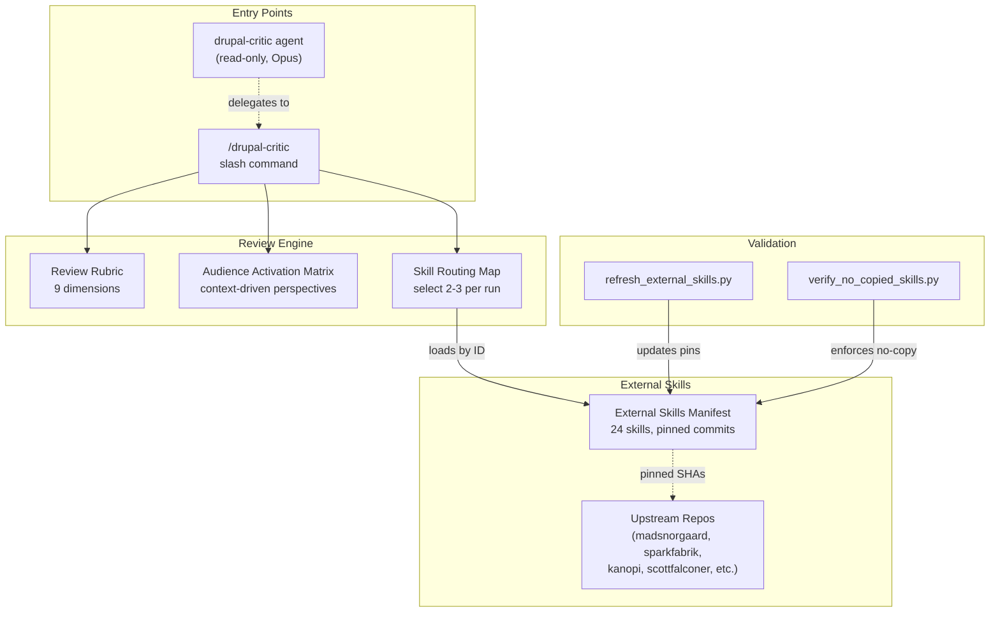
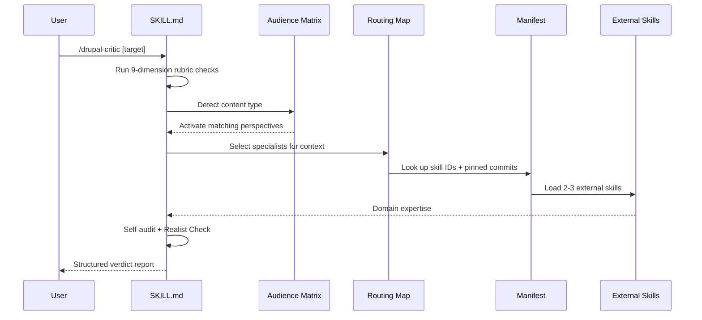

# drupal-critic

A Drupal-specific review skill for [Claude Code](https://docs.anthropic.com/en/docs/claude-code) that layers domain expertise on top of [harsh-critic](https://github.com/zivtech/harsh-critic)'s structured investigation protocol. It adds Drupal-specific checks — cache correctness, config workflow safety, contrib-first decisions, render security, migration idempotency — and activates context-driven review perspectives that generic reviewers don't know to apply.

**[Visual Explainer](https://zivtech.github.io/drupal-critic/)** | [harsh-critic](https://github.com/zivtech/harsh-critic) (companion project)

## The problem with generic Drupal reviews

General-purpose reviewers can catch logic bugs and security oversights, but they miss Drupal-specific failure modes: cache tags that don't invalidate, config exports that break on deploy, contrib modules reimplemented as custom code, update hooks that aren't idempotent, and editorial workflows that make content editors' lives harder. These issues require domain knowledge that generic review prompts don't carry.

## How it works

drupal-critic extends harsh-critic's protocol (pre-commitment, verification, multi-perspective, gap analysis, self-audit, realist check, synthesis) and includes plan-specific investigation checks, a mandatory confidence-gated self-audit before verdict, and a Realist Check that pressure-tests CRITICAL/MAJOR findings for real-world severity — downgrading when impact doesn't match the label while never downgrading data loss, security breaches, or financial impact.

### Drupal review rubric

Every review checks 9 dimensions tuned to Drupal's architecture:

1. **Security** — routes, entity queries, input validation, safe Twig rendering, SQL builder usage
2. **Architecture** — contrib-first decisions, dependency injection patterns, hooks vs. subscribers vs. plugins, config schema
3. **Open Source** — upstream patch viability, issue queue research, contrib maintenance burden
4. **Site Builder** — admin UX, permissions, workflows, config stability, Drush alignment
5. **Content Editor** — editorial workflow clarity, authoring UX, metadata/SEO, editing friction
6. **Operational Safety** — update/rollback path, Composer constraints, Drush steps, error handling
7. **Caching** — tags/contexts/max-age correctness, personalization handling, BigPipe/lazy builders
8. **Testing** — proportional test strategy, risky path validation, acceptance checks
9. **Confidence** — evidence-backed findings vs. speculative concerns

### Context-driven audience activation

Three perspectives always run: **Security**, **New-hire**, **Ops**.

Three more activate based on what's being reviewed:

- **Open Source Contributor** — activates when contrib/core behavior is overridden in custom code, a bugfix targets leveraged third-party code, or a change introduces long-term patch maintenance burden. Asks: should this become an upstream patch? Is custom code duplicating behavior that belongs in contrib?

- **Site Builder (Drupal Admin UI)** — activates when changes touch content types, views, display modes, workflows, moderation, permissions, menus, media, or admin config pages. Asks: can site builders manage this in UI without developer-only steps? Are config dependencies understandable and stable?

- **Content Editor/Marketer** — activates when changes affect editorial workflow, content authoring UX, content model, metadata/SEO, campaign pages, or publishing cadence. Asks: does this increase editorial friction? Are metadata/SEO and governance needs covered?

### External skill orchestration

Instead of vendoring Drupal knowledge into a single monolithic prompt, drupal-critic references 24 external specialist skills by ID with pinned commit SHAs. Each review run loads max 2-3 relevant skills selected via a routing map — keeping context focused and up-to-date with upstream improvements.

### Architecture overview



<details>
<summary>Review sequence (runtime flow)</summary>



</details>

## Output format

Same structured report as harsh-critic, with Drupal-specific findings woven into each section:

- **Verdict**: REJECT / REVISE / ACCEPT-WITH-RESERVATIONS / ACCEPT
- **Overall assessment**: 2-3 sentence quality summary
- **Pre-commitment predictions**: Expected Drupal-specific problem areas vs. actual findings
- **Critical findings**: Blocks execution. Must include `file:line` evidence.
- **Major findings**: Causes significant rework. Must include evidence.
- **Minor findings**: Suboptimal but functional.
- **What's missing**: Gaps, unhandled edge cases, unstated assumptions.
- **Ambiguity risks** (plan reviews only): Multiple valid interpretations with consequence if the wrong one is chosen.
- **Multi-perspective notes**: Security, new-hire, ops, and activated Drupal perspectives.
- **Verdict justification**: Why this verdict, what would upgrade it, and whether adversarial escalation was triggered.
- **Open questions (unscored)**: Speculative or low-confidence concerns moved out of scored sections.

## Relationship with harsh-critic

harsh-critic provides the general-purpose structured investigation protocol. drupal-critic adds domain-specific checks on top:

| | harsh-critic | drupal-critic |
|---|---|---|
| **Scope** | Any code, plan, or analysis | Drupal modules, themes, config, deploy workflows |
| **Perspectives** | Security, new-hire, ops | Same core + Open Source Contributor, Site Builder, Content Editor |
| **Domain checks** | None — general-purpose | 9-dimension Drupal rubric (cache, config, contrib, migrations, etc.) |
| **External skills** | None | Orchestrates up to 3 of 24 pinned external Drupal skills per run |
| **Best used for** | General code/plan review | Module updates, cache behavior, config sync, migration plans, contrib patches |

For Drupal-heavy changes, run drupal-critic first. Optionally follow with harsh-critic as a second-pass general review.

## Referenced external skills

drupal-critic coordinates 24 external skills across 6 categories, pinned to specific commits for reproducibility:

### Core Review

- [**drupal-expert**](https://github.com/madsnorgaard/agent-resources) by madsnorgaard — Drupal 10/11 development expertise covering modules, themes, hooks, services, configuration, and migrations. Enforces contrib-first research and dependency injection.
- [**drupal-security**](https://github.com/madsnorgaard/agent-resources) by madsnorgaard — Proactively identifies security vulnerabilities (XSS, SQL injection, access bypass) while Drupal code is being written, not after.
- [**drupal-update**](https://github.com/bethamil/agent-skills) by bethamil — Automates Drupal module updates in DDEV environments with safety snapshots, composer update, drush updb, config export, and changelog generation.
- [**drupal-development**](https://github.com/mindrally/skills) by mindrally — Drupal development guidelines and best practices, part of a 240+ skill collection converted from Cursor rules.

### Contrib & Issue Queue

- [**drupal-issue-queue**](https://github.com/scottfalconer/drupal-issue-queue) by scottfalconer — Searches Drupal.org issue queues and summarizes individual issues for triage using drupalorg-cli and the Drupal.org API.
- [**drupal-contribute-fix**](https://github.com/scottfalconer/drupal-contribute-fix) by scottfalconer — Searches Drupal.org before writing code changes to contrib/core, then packages contribution-ready artifacts (diffs, issue comments, reports).
- [**drupalorg-issue-helper**](https://github.com/kanopi/cms-cultivator) by Kanopi Studios — Helps write Drupal.org issue reports with proper HTML templates, formatting, and best practices for bug reports and feature requests.
- [**drupalorg-contribution-helper**](https://github.com/kanopi/cms-cultivator) by Kanopi Studios — Guides Drupal.org contribution workflows including git commands, issue fork setup, branch naming, and merge request creation.

### Cache & Rendering

- [**drupal-cache-contexts**](https://github.com/sparkfabrik/sf-awesome-copilot) by SparkFabrik — Cache context selection and usage patterns for request-dependent content variations.
- [**drupal-cache-tags**](https://github.com/sparkfabrik/sf-awesome-copilot) by SparkFabrik — Cache tag assignment and invalidation patterns for Drupal's data-dependent cache layer.
- [**drupal-cache-maxage**](https://github.com/sparkfabrik/sf-awesome-copilot) by SparkFabrik — Time-based cache expiration configuration and max-age propagation in Drupal's render pipeline.
- [**drupal-dynamic-cache**](https://github.com/sparkfabrik/sf-awesome-copilot) by SparkFabrik — Dynamic page cache behavior, auto-placeholdering, and per-user content handling.
- [**drupal-cache-debugging**](https://github.com/sparkfabrik/sf-awesome-copilot) by SparkFabrik — Techniques for diagnosing cache misses, stale content, and incorrect cache metadata.
- [**drupal-lazy-builders**](https://github.com/sparkfabrik/sf-awesome-copilot) by SparkFabrik — Lazy builder pattern for deferring render-heavy or uncacheable content out of the main response.

### Canvas/Components

- [**canvas-component-definition**](https://github.com/drupal-canvas/skills) by Drupal Canvas — Defining Canvas Code Components for Drupal's visual page builder.
- [**canvas-component-metadata**](https://github.com/drupal-canvas/skills) by Drupal Canvas — Component metadata schemas and prop definitions for Canvas components.
- [**canvas-component-utils**](https://github.com/drupal-canvas/skills) by Drupal Canvas — Utility functions and helpers for Canvas component development.
- [**canvas-data-fetching**](https://github.com/drupal-canvas/skills) by Drupal Canvas — Data fetching patterns for server-side and client-side data in Canvas components.
- [**canvas-styling-conventions**](https://github.com/drupal-canvas/skills) by Drupal Canvas — CSS and styling conventions for Canvas Code Components.
- [**canvas-component-composability**](https://github.com/drupal-canvas/skills) by Drupal Canvas — Patterns for nesting and composing Canvas components together.
- [**canvas-component-upload**](https://github.com/drupal-canvas/skills) by Drupal Canvas — Packaging and uploading Canvas components to a Drupal site.

### Tooling

- [**drupal-ddev**](https://github.com/grasmash/drupal-claude-skills) by grasmash — DDEV local development patterns for Drupal including configuration, database management, Xdebug, and performance optimization.
- [**drupal-tooling**](https://github.com/omedia/drupal-skill) by Omedia — Drupal development tooling for DDEV environments and Drush command-line operations across Drupal 8–11+.
- [**ddev-expert**](https://github.com/madsnorgaard/drupal-agent-resources) by madsnorgaard — DDEV expertise covering Docker-based local development, project management, custom services, and CI/CD integration.

Full manifest with pinned commits, URLs, and metadata:
`.claude/skills/drupal-critic/references/external-skills-manifest.yaml`

## Install

### As a skill (adds `/drupal-critic` command)

```bash
git clone https://github.com/zivtech/drupal-critic.git
cp -r drupal-critic/.claude/skills/drupal-critic ~/.claude/skills/
```

Or with [npx claude-skills](https://www.npmjs.com/package/claude-skills):

```bash
npx claude-skills add https://github.com/zivtech/drupal-critic
```

### As an agent (adds `drupal-critic` to agent list)

```bash
cp drupal-critic/.claude/agents/drupal-critic.md ~/.claude/agents/
```

### Both

Install both for maximum flexibility. The skill gives you the `/drupal-critic` slash command. The agent gives you a read-only reviewer (Write/Edit tools disabled) that can be invoked by other agents or by name.

## Usage

### Skill (slash command)

```
/drupal-critic the module update plan
/drupal-critic web/modules/custom/my_module/
/drupal-critic the migration code that was just written
```

### Agent (via agent picker or other agents)

The agent at `~/.claude/agents/drupal-critic.md` is automatically available in Claude Code's agent system. It runs at Opus tier with Write/Edit tools disabled — it reviews but cannot modify.

### When to use it

- Drupal module updates, especially security updates with hook changes
- Cache invalidation logic (tags, contexts, max-age decisions)
- Config sync workflows (drush cex/cim, config_split, deploy sequences)
- Migration plugins and update hooks
- Contrib module overrides or patches with long-term maintenance implications
- Content type / views / workflow changes that affect editorial UX

### When not to use it

- Non-Drupal code — use harsh-critic instead
- Quick config-only changes with no logic — just review directly
- When you want code changes made — use an implementation agent instead

## Maintenance

Refresh external skill pinned commits:
```bash
python3 scripts/refresh_external_skills.py
```

Verify no-copy policy and manifest integrity:
```bash
python3 scripts/verify_no_copied_skills.py
```

Both scripts require PyYAML (`pip install pyyaml`). CI runs both on every push/PR.

## Compatibility

- **Claude Code**: Works standalone, no plugins required.
- **harsh-critic**: Designed to complement harsh-critic. Run drupal-critic for domain-specific review, then optionally harsh-critic for general second-pass.

## What's included

```
.claude/
  skills/
    drupal-critic/
      SKILL.md                            # Skill definition (adds /drupal-critic slash command)
      references/
        external-skills-manifest.yaml     # 24 external skills with pinned commits
        drupal-review-rubric.md           # 9-dimension review checklist
        audience-activation-matrix.md     # Context-driven perspective triggers
        skill-routing-map.md              # Specialist skill selection guide
  agents/
    drupal-critic.md                      # Agent prompt (read-only reviewer, Opus tier)
scripts/
  refresh_external_skills.py              # Update pinned commits from upstream
  verify_no_copied_skills.py             # Enforce no-copy policy
```

## License

Apache 2.0
